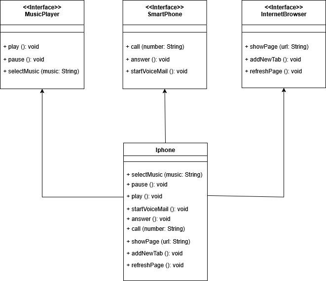

## Introdução

Projeto criado para o Bootcamp Santander DIO 2025.

## Objetivo
Criar notação UML para implementação das funções do Iphone, a saber:

- Reprodutor Musical:

    - Métodos: tocar(), pausar(), selecionarMusica(String musica)

- Aparelho Telefônico:
    
    - Métodos: ligar(String numero), atender(), iniciarCorreioVoz()

- Navegador na Internet

    - Métodos: exibirPagina(String url), adicionarNovaAba(), atualizarPagina()

## Notação UML Iphone

## Organização do Projeto
O projeto está organizado da seguinte forma:

- Interfaces:

    - Interface InternetBrowser, para as funções de Navegador de Internet;

    - Interface MusicPlayer, para as funções do Player de Música; 

    - Interface SmartPhone, para as funções de Telefone.

- Classes: 

    - Iphone: Classe que implementa as interfaces; 
    - App: Clase para testar as funcionalidades.

Feito com ❤️ por Alan Leandro Domingos
